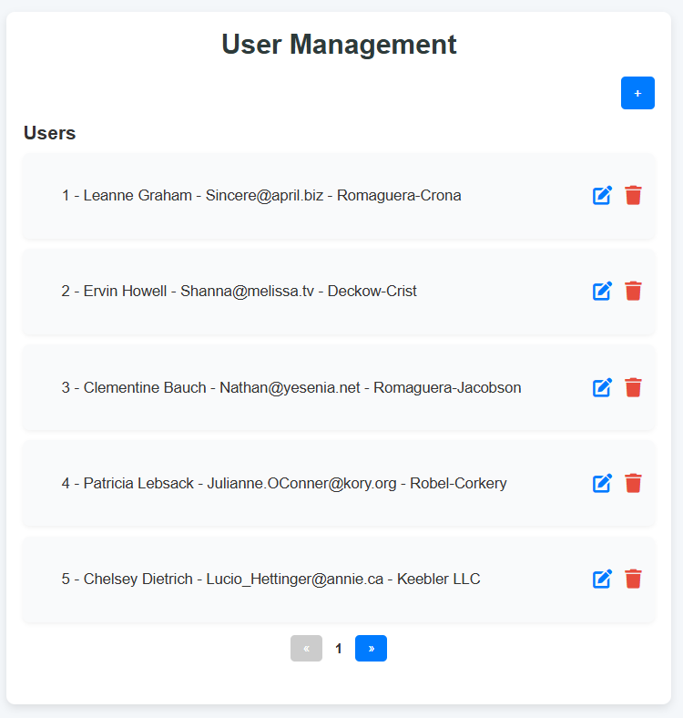

# React User Management Application

A responsive React application for managing user information. This application supports adding, editing, deleting, and viewing users with pagination. The application fetches initial user data from an API and allows CRUD operations on users locally.

 <!-- Replace with the actual path to your output image -->

---

## Features

- **CRUD Operations**: Add, edit, delete, and view users.
- **Pagination**: Navigate through user data efficiently.
- **Real-time Feedback**: Get instant notifications for actions with `react-toastify`.
- **Responsive Design**: Optimized for both desktop and mobile screens.
- **User-friendly Interface**: Clean and intuitive UI with interactive elements.

---

## Tech Stack

- **Frontend**: React.js
- **CSS**: Custom styles for an attractive UI
- **Notifications**: `react-toastify`
- **API**: Fetches initial user data from [JSONPlaceholder](https://jsonplaceholder.typicode.com)

---

## Prerequisites

- Node.js installed on your system.
- Basic knowledge of React and JavaScript.

---

## Setup Instructions

1. Clone the repository:
   ```bash
   git clone https://github.com/your-username/react-user-management.git
   ```
2. Navigate to the project directory:
   ```bash
   cd react-user-management
   ```
3. Install dependencies:
   ```bash
   npm install
   ```
4. Start the development server:
   ```bash
   npm start
   ```
5. Open the application in your browser:
   ```
   http://localhost:3000
   ```

---

## Project Structure

```plaintext
react-user-management/
├── public/
├── src/
│   ├── App.js         # Main application logic
│   ├── App.css        # Styles for the application
│   ├── index.js       # Application entry point
│   ├── components/    # Reusable React components
├── README.md          # Project documentation
├── package.json       # Project dependencies and scripts
```

---

## Output Screenshot


---

## How to Use

1. Click the **"+" button** to add a new user.
2. Use the **edit icon** to update user details.
3. Use the **delete icon** to remove a user.
4. Navigate through pages using the **pagination controls**.

---

## Customization

- Update the `API_URL` in `App.js` to fetch data from a custom API.
- Modify styles in `App.css` to match your branding.

---

## Dependencies

- [React](https://reactjs.org/)
- [Axios](https://axios-http.com/)
- [React Toastify](https://fkhadra.github.io/react-toastify/)

